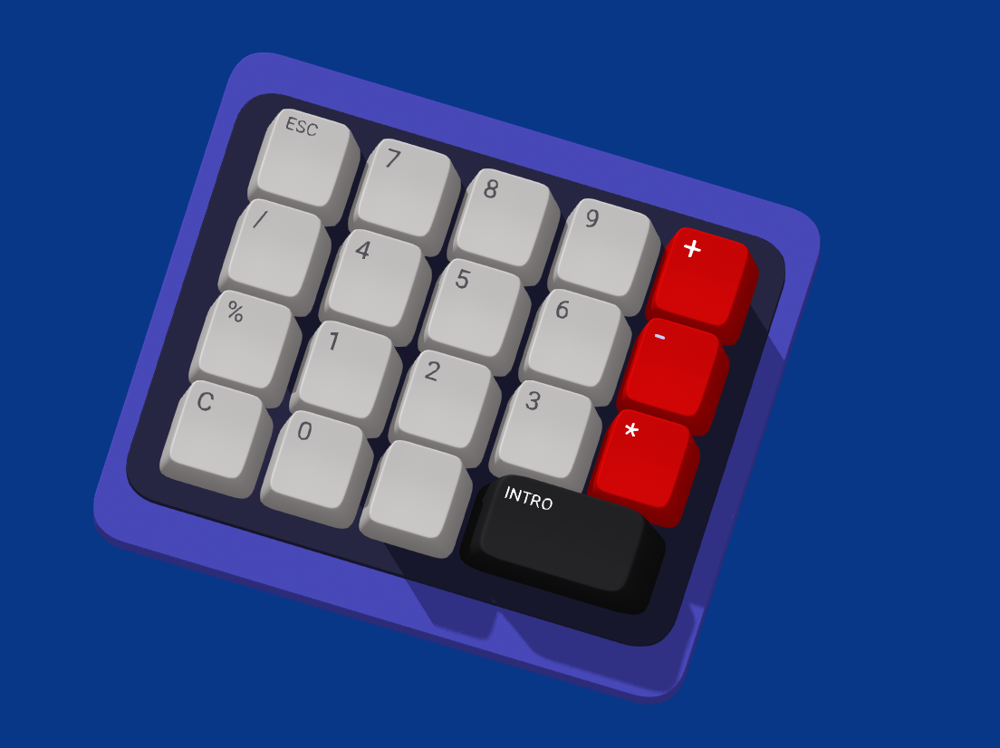

# Calculator
calculator &amp; spline

El presente documento muestra la realización de una calculadora utilizando Spline haciendolo responsive con el index.html

Se inicia creando un nuevo documento en *spline*, no se profundizara en el uso del **spline** pues este no es el proposido de este proyecto.

Una vez, creada las respectivas piezas con los colores que queremos se prosigue a crear eventos para que este tenga una animación.

Para eso nos vamos seleccionamos el conjunto ***key6*** y al states de damos crear (+) y bajamos la imagen que tenemos en esa instancia.

Una vez creada, creamos el evento, lo editamos seleccionando primero en **star** y elegimos el ***key down***

Para que responda al teclado le damos a *key* y seleccionamos el teclado que responda en este caso sera el **6**.

Proseguimos a crear la transición, en esta parte a gusto de cada quien eligira la duracion de la transición. Para este caso se eligio **0.10** segundos en el apartado de *duration*.

Ahora se va a crear el evento para que suba se elige el ***key up*** en *key* elegimos el teclado al que va a responder el cual es el *6*, y en **To** se cambia a ***base state*** para que suba con una duracion de **0.20**.

Este mismo procedicimiento se va a repetir para todas las key, poniendo el respectivo teclado para que sea responsive. Por ultimo se cambia el color de fondo a uno azul, y el rectangulo dos a uno morado.

En el siguiente enlace se encuentra la calculadora realizada en spline [link](https://my.spline.design/untitled-0db12e533dd2cd30702620ce764676d0/)